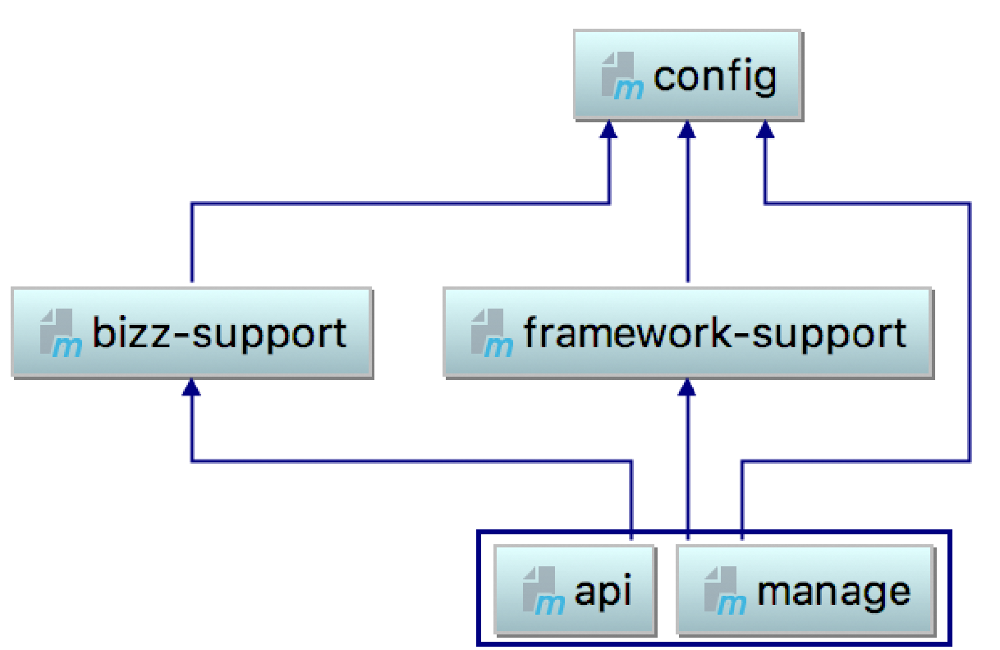
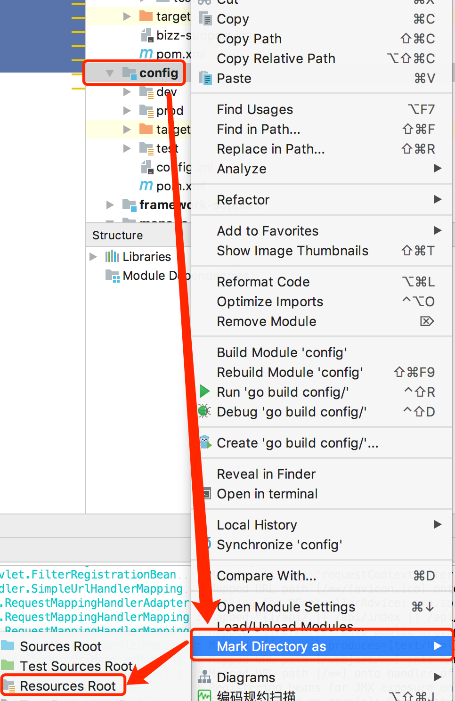

# 1. 搭建准备&使用场景
- IDE: InteliJ IDEA
- JDK: 1.8
- SpringBoot: 2.0.3.RELEASE
- 使用场景: 中小型项目, API 和后台管理 分开部署
# 2. 模块说明

- config: 配置中心模块
- bizz-support: 业务支持模块, 存放根据表生成的通用 Service, Mapper
- framework-support: 框架支持模块
- api: API 接口模块
- manage: 后台管理模块


# 3. 模块搭建

## 3.1 parent
1. 使用 IDEA 或者 官网的 Spring initializr创建一个空项目multi-module-springboot, 删除多余文件.
2. pom.xml 中将 packaging 改成 pom 提供 依赖版本管理
3. <dependencies> 标签外面嵌套一层 <dependencyManagement>
4. 删除 <build>
## 3.2 api
1. Spring initializr 创建一个项目, 父模块引入 spring-boot-starter-web, api 对应配置
且设置父模块为multi-module-springboot
2. 新建 Controller
```

@RestController
@RequestMapping("/api")
public class HelloRestfulController {

	@GetMapping({"/", "index", "index.html"})
    public Map adminIndex() throws Exception {

        return new HashMap(3) {{
            put("code", 0);
            put("message", "成功");
            put("data", "Hello World!");
        }};
}
```
3. 测试完成
```
$ curl http://localhost:8766/api/
{"message":"成功","data":"Hello World!","code":0}
```
## 3.3 manage
1. 如创建 3.2 api 模块一样创建 manage 模块
2. 添加 thymeleaf 依赖
```
<springboot.version>2.0.3.RELEASE</springboot.version>
<nekohtml.version>1.9.22</nekohtml.version>
<thymeleaflayout.version>2.3.0</thymeleaflayout.version>
<thymeleaf.version>3.0.9.RELEASE</thymeleaf.version>
```
```
 <!--<editor-fold desc="THYMELEAF 页面模板引擎">-->
 <dependency>
     <groupId>org.springframework.boot</groupId>
     <artifactId>spring-boot-starter-thymeleaf</artifactId>
     <version>${springboot.version}</version>
     <!-- 排除掉默认的版本 -->
     <exclusions>
         <exclusion>
             <groupId>org.thymeleaf</groupId>
             <artifactId>thymeleaf</artifactId>
         </exclusion>
         <exclusion>
             <groupId>org.thymeleaf</groupId>
             <artifactId>thymeleaf-spring5</artifactId>
         </exclusion>
     </exclusions>
 </dependency>
 <dependency>
     <groupId>net.sourceforge.nekohtml</groupId>
     <artifactId>nekohtml</artifactId>
     <version>${nekohtml.version}</version>
 </dependency>
 <dependency>
     <groupId>nz.net.ultraq.thymeleaf</groupId>
     <artifactId>thymeleaf-layout-dialect</artifactId>
     <version>${thymeleaflayout.version}</version>
 </dependency>
 <dependency>
     <groupId>org.thymeleaf</groupId>
     <artifactId>thymeleaf-spring5</artifactId>
     <version>${thymeleaf.version}</version>
 </dependency>
 <dependency>
     <groupId>org.thymeleaf</groupId>
     <artifactId>thymeleaf</artifactId>
     <version>${thymeleaf.version}</version>
 </dependency>
 <!--</editor-fold>-->
```
3. resources 下面新建 templates/home.html
4. application.properties 配置 thymeleaf
```
spring.thymeleaf.cache=false
spring.thymeleaf.prefix=classpath:/templates/
spring.thymeleaf.suffix=.html
spring.thymeleaf.mode=HTML
spring.resources.chain.strategy.content.enabled=true
spring.resources.chain.strategy.content.paths=/**
```
5. 新建 Controller
```
package com.logictech.manage;

import org.springframework.stereotype.Controller;
import org.springframework.ui.ModelMap;
import org.springframework.web.bind.annotation.GetMapping;

/**
 * @author JG.Hannibal
 * @since 2018/7/4 14:25
 */
@Controller
public class HelloViewController {

    @GetMapping({"/hello"})
    public String adminIndex(ModelMap model) throws Exception {
        model.addAttribute("text", "Hello World!");
        return "home";
    }

}
```
6. 测试完成
```
$ curl http://localhost:8765/hello
<!DOCTYPE html>
<html lang="en">
<head>
    <meta charset="UTF-8">
    <title>Title</title>
</head>
<body>
<div>Hello World!</div>
<div>Hello World!</div>
</body>
</html>
```
## 3.4 config
1. 工程右键, 新建 Maven 子模块 config (该次**不是**Spring initializr), 因为该工程作为 resources root, 所以将除了pom.xml 的文件全部删除.
2. 新建 profile 文件夹, 便于不同环境的发布部署
```
cd config
vi dev/application.properties prod/application.properties test/application.properties
```
3. 每个application中加入配置内容
```
#每个配置文件自己的 profile, 例: env=dev
env=*
#这边端口每个配置文件不一样就可以
server.port=876*
# 之前配置的模板引擎的配置一致
spring.thymeleaf.cache=false
spring.thymeleaf.prefix=classpath:/templates/
spring.thymeleaf.suffix=.html
spring.thymeleaf.mode=HTML
spring.resources.chain.strategy.content.enabled=true
spring.resources.chain.strategy.content.paths=/**
```
4. IDEA设置为 resources root

5. 测试, 将 api 工程中resources/application.properties 删除, 依赖引入 config, 改写 Controller, 将 env 打印出来.
```
@RestController
@RequestMapping("/api")
public class HelloRestfulController {

    @Value("${env}")
    private String env;


    @GetMapping({"/", "index", "index.html"})
    public Map adminIndex() throws Exception {

        return new HashMap(3) {{
            put("code", 0);
            put("message", "成功");
            put("data", "This Active Profile is: [" + env + "]");
        }};
    }

}
```
6. 修改启动环境变量, 将 config 路径配置到我们的子模块内,测试完成.
```
java -jar api-0.0.1-SNAPSHOT.jar --spring.profiles.active=dev
--spring.config.location=classpath:${spring.profiles.active}/
```
```
$ curl http://localhost:8765/api/
{"message":"成功","data":"This Active Profile is: [dev]","code":0}
```
> **manage 模块的改造和 api 一致**

> 存在一个问题, 即 运行 api 模块时, Maven 找不到 config-0.0.1-SNAPSHOT.jar
> 只需要到 Maven 界面, 将 Nexus的勾选去掉即可.
## 3.5 framework-support
1. 新建 Maven 子模块 framework-support, 添加spring-boot-starter-web依赖, config 依赖
这边我们先实现 Controller 的一个 AOP, 所以引入spring-aop 包括AspectJ
```
<!--<editor-fold desc="AOP">-->
<dependency>
    <groupId>org.springframework.boot</groupId>
    <artifactId>spring-boot-starter-aop</artifactId>
    <version>${springboot.version}</version>
</dependency>
<dependency>
    <groupId>org.aspectj</groupId>
    <artifactId>aspectjrt</artifactId>
    <version>${aspectj.version}</version>
</dependency>
<dependency>
    <groupId>org.aspectj</groupId>
    <artifactId>aspectjweaver</artifactId>
    <version>${aspectj.version}</version>
</dependency>
<!--</editor-fold>-->
```
2. 编写 ControllerLoggerAop
3. 将 framework-support 的包 **添加** 到 API 的主函数ComponentScan 里去, API 添加 framework-support依赖.
4. 测试完成
```
$ curl http://localhost:8766/api/
{"message":"成功","data":"This Active Profile is: [prod]","code":0}
```
```
##########|    URL : http://localhost:8766/api/
##########|    HTTP_METHOD : GET
##########|    IP : 127.0.0.1
##########|    CLASS_METHOD : com.logictech.api.HelloRestfulController.adminIndex
##########|    ARGS : []
====================================================
##########|    RESPONSE : {message=成功, data=This Active Profile is: [prod], code=0}
====================================================

```
## 3.6 bizz-support
1. 创建Maven子模块 bizz-support, 根据需要创建依赖
2. 创建 CommonConst
```
public class CommonConst {
    public static final String PROJECT_NAME = "MULTI_MODULE_SPRING_BOOT";
}

```
3. api 模块改写 Controller, 测试完成
```
@RestController
@RequestMapping("/api")
public class HelloRestfulController {

    @Value("${env}")
    private String env;


    @GetMapping({"/", "index", "index.html"})
    public Map adminIndex() throws Exception {

        return new HashMap(3) {{
            put("code", 0);
            put("message", "成功");
            put("data", "This Active Profile is: [" + env + "], Project Name: [" + PROJECT_NAME + "]");
        }};
    }

}
```
```
$ curl http://localhost:8766/api/
{"message":"成功","data":"This Active Profile is: [prod], Project Name: [MULTI_MODULE_SPRING_BOOT]","code":0}
```
----------
# 4. 总结

还是就最开始那张图来讲, 该工程分为大体分为三块:
- config: 配置中心, 可供后期改造成分布式的配置中心
- support:  支持中心, 核心模块, framework-support 和 bizz-support 其实可以放一起
但是更清晰一点,后期可以把 bizz-support 改造成 rbc服务.
- business: 业务模块, 展现层

相同的层级的配置可以类比配置.
另外, 写得没有面面俱到, 多模块工程V0.0.1版本, 后期会继续完善.


